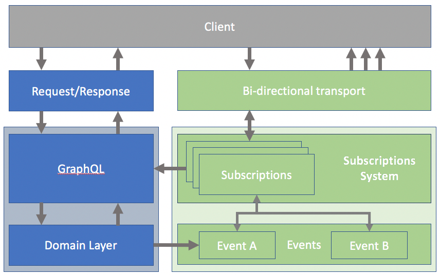
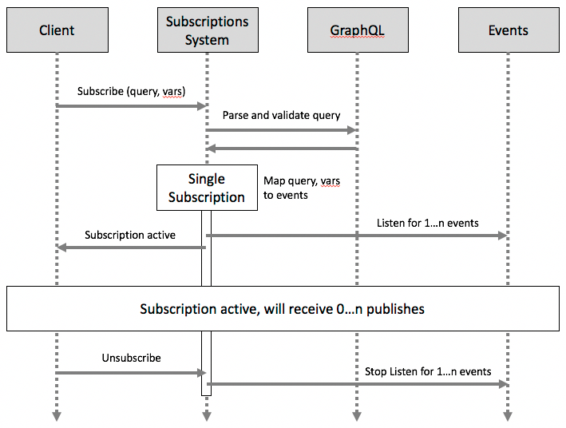
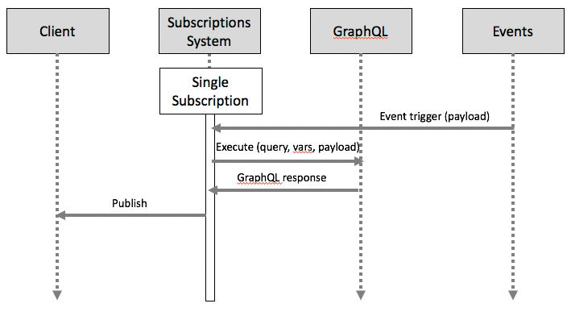

RFC: GraphQL Subscriptions
-------

*Working Draft - February 2017*

**Introduction**

Modern applications increasingly include scenarios where users receive immediate feedback when something interesting happens. When these applications outgrow simple polling solutions, they turn to stateful, bi-directional solutions that push data from server to client. There are many ways to extend GraphQL to support push-based solutions. By standardizing these concepts and solutions, we can keep the community cohesive, and ensure sustainable future improvements.

**Background**

Using the standard request/response GraphQL model, apps can support realtime scenarios by repeatedly issuing the same GraphQL query. However, this solution is inefficient and large scale apps may prefer push-based solutions. Compared to polling, push-based solutions trade off statelessness and simplicity for efficiency while raising new questions and challenges. For example: how is an “interesting event” detected and propagated? How does the GraphQL language express these semantics? How does this affect the client-side GraphQL API?

There are multiple valid answers to these questions, several of which have been proposed by the open-source community already [1][2][3]. At Facebook, we have been using “GraphQL Subscriptions” [4] at scale since 2015. Following our open-source philosophy, we now believe this system is useful and generalizable. We would like to contribute our ideas to the conversation.

One of GraphQL's superpowers is allowing clients to specify exactly the data they need, sidestepping two problems known as “overfetching" and "underfetching”. With push-based solutions, we have a similar problems: “overpushing" and "underpushing". Underpushing means we didn't send enough data, and the client now needs to make a follow-up network request. Overpushing means we sent the client too much data; in the best case this data is irrelevant and wastes network resources. In the worst case, this data contains sensitive information that the client should not see. Just as request/response GraphQL addresses overfetching and underfetching, GraphQL Subscriptions addresses overpushing/underpushing.

**Possible Solutions**

We broadly categorize realtime API solutions into three types:

 * **Polling**- the client periodically issues a request to check on the state of the data it cares about. Polling solutions are simple, stateless, and work with existing GraphQL applications with little extra code. However, polling is difficult to tune. When updates are infrequent/unpredictable, polling is wasteful. When updates are frequent, polling introduces additional latency. If apps outgrow polling-based solutions, they should evaluate Event-based Subscriptions and Live Queries.

 * **Event-based Subscriptions**- the client tells the server that it cares about one or more events. Whenever those events trigger, the server notifies the client. This model requires the server to identify a well-known set of events, and how to raise/propagate them, ahead of time. Subscriptions require server-side state, such as which subscriptions are active, what events they are listening to, and the mapping of client connections to subscriptions. Among event-based subscriptions, we see a few sub-classes:

   * **Fixed-payload Subscriptions**- clients only tell the server about the event(s) they're interested in and are then pushed fixed payloads. That is, the payload contents are determined by the server. For example, a flight tracker broadcasts “Flight 123 is delayed by 30 minutes” to all subscribers. This type of solution works for cases where all clients should receive the same payload. For cases where the payload is more complex or differs between users, fixed-payloads potentially send data that the client doesn't need, resulting in over-pushing.

   * **Zero-payload Subscriptions**- this type of subscription sends empty events to the client where it triggers a data fetch or client-side state invalidation. Essentially, this style always under-pushes. This style simplifies the server, but the client is now responsible for interpreting and reacting events coming from the server. This technique also has higher latency since the client must issue a network request in response to any non-trivial event to fetch more data.

   * **Data-transform pipelines**- for cases where data payloads differ between subscribers, there is a class of systems that uses dynamically configurable data streams. These systems require a more sophisticated event layer capable of dynamically specifying per-subscriber data-transform logic. This way, the output payload from the event layer is already subscriber-specific. The drawback of these systems is high complexity and distributed business logic. Our proposal (GraphQL Subscriptions) builds on this type of solution.

 * **Live Queries**- the client issues a standard query. Whenever the answer to the query changes, the server pushes the new data to the client. The key difference between Live Queries and Event-based Subscriptions is that Live Queries do not depend on the notion of events. The data itself is live and includes mechanisms to communicate changes. Note that many event-based use cases can be modeled as live queries and vice versa. Live Queries require reactive data layers, polling, or a combination of the two [5].

In the case of subscriptions and live queries, the addition of server-side state means production-grade systems will need to consider scalability, high-availability, throttling, buffering, and event/delivery rate mismatches in their designs.

**Proposed Solution: GraphQL Subscriptions**

In "GraphQL Subscriptions", clients send the server a GraphQL query and query variables. The server maps these inputs to a set events, and executes the query when the events trigger. This model avoids overpushing/underpushing but requires a GraphQL backend. GraphQL Subscriptions provides an abstraction over individual events and exposes an API where the client subscribes to a query. Compared with existing data-transform pipeline techniques, GraphQL Subscriptions produces privacy-aware, right-sized payloads without pushing business logic to the event/messaging layer.

At Facebook, we believe GraphQL Subscriptions exhibits a set of useful tradeoffs and warrants definition and inclusion in the GraphQL specification. By specifying GraphQL Subscriptions, we hope to achieve the following goals:

* Make GraphQL Subscriptions a great API choice for building realtime applications.

* Enable interoperability between GraphQL Subscription clients and servers without restricting implementation.

* Enable a strong tooling ecosystem (including GraphiQL).

* Provide concrete guidance to anyone currently building/operating systems to support GraphQL Subscriptions.

* Provide clarity to teams evaluating GraphQL Subscriptions.

We'll try to define the irreducible components of a GraphQL Subscriptions system below:

* **Subscriptions System:** a component that manages the lifetime of Subscription objects. Each individual subscription executes a query in response to one or more events. Subscriptions are created by specifying a query and optional query variables. These inputs are then mapped to a set of events. Whenever one of these events fires, the subscription executes the query, variables, and event data and invokes the specified callback function with the response.

* **Events**: any “interesting thing” the system cares about. Events contain optional data to describe what happened. For example, a “new email” event might include the ID of the new email. The combination of query, query variables, and event data is executed to create a GraphQL response in the shape that the client expects.

*Above, the light blue box on the left contains the components for a traditional request/response GraphQL system. The light green box on the right contains the new components needed to support GraphQL Subscriptions.*

The lifetime of a subscription looks like this:

* **Subscribe:** the Client initializes a subscription by sending a query and its variables to the server.  When the Subscription is created, the input query and variables are mapped to a set of events to which the Subscription listens.

* **Publish:** when any of the events associated with the subscription are triggered, the subscription executes the query, variables, and payload and sends the result to the client.

* **Unsubscribe:** when a client becomes unsubscribed from a subscription, it will no longer receive payloads. This can happen when the client explicitly unsubscribes or when the server determines that unsubscription should occur, for example when the client has disconnected.

**Subscribe/Unsubscribe:**

**Single Publish:**

*Note: the notion of a “Single Subscription” is logical. The implementation does not need to create one subscription object per client.*

We look forward to comments, feedback, and discussion on this RFC.

**References**

[1] [Proposal for GraphQL Subscriptions by Apollo](https://dev-blog.apollodata.com/a-proposal-for-graphql-subscriptions-1d89b1934c18)

[2] [Event-stream based GraphQL Subscriptions](https://gist.github.com/OlegIlyenko/a5a9ab1b000ba0b5b1ad)

[3] [Subscriptions in GraphQL by Kadira](https://kadira.io/blog/graphql/subscriptions-in-graphql)

[4] [Subscriptions in GraphQL and Relay](http://graphql.org/blog/subscriptions-in-graphql-and-relay/)

[5] [Why not live queries?](http://graphql.org/blog/subscriptions-in-graphql-and-relay/#why-not-live-queries)
